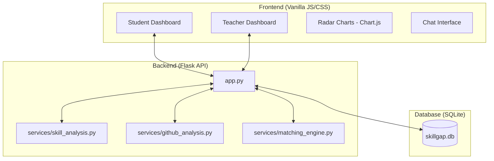

# Implementation Plan - Skill Gap Radar Redesign

Redesign the "Skill Gap Radar" into a clean, scalable AI-powered mentorship platform with a clear user flow and modular architecture.

## System Architecture

## User Flow
1. **Student Registration**: Role-based signup.
2. **Profile Setup**: Student uploads resume and provides GitHub username.
3. **AI Analysis**: `skill_analysis` and `github_analysis` modules process the data to generate a radar chart.
4. **Mentorship Request**: Student specifies a goal and a project idea.
5. **Teacher Match**: `matching_engine` suggests mentors based on skill gap and expertise.
6. **Teacher Review**: Teacher views incoming requests and student gap reports.
7. **Acceptance**: Teacher accepts student into a mentorship group.
8. **Guidance**: Unified chat for ongoing mentorship and project collaboration.

## Proposed Changes

### System Architecture
The system will be refactored into a clear 3-tier architecture:
- **Frontend**: Modern, responsive UI using Vanilla CSS, Glassmorphism, and Chart.js for radar charts.
- **Backend**: Modular Python (Flask) with logic extracted into service modules.
- **Database**: Redesigned SQLite schema for students, teachers, mentorship requests, and groups.

---

### Backend Refactoring
Refactor the monolith [app.py](file:///c:/Users/Anupam%20Mishra/OneDrive/Desktop/skill-gap-ai/app.py) and standalone scripts into a service-oriented structure.

#### [NEW] [skill_analysis.py](file:///c:/Users/Anupam%20Mishra/OneDrive/Desktop/skill-gap-ai/services/skill_analysis.py)
Extends current resume parsing with categorized skill detection and weighting.
- Compare Resume + GitHub vs Job Role/Goal.
- Calculate Match %, Gap Score, and Strength Score.

#### [NEW] [github_analysis.py](file:///c:/Users/Anupam%20Mishra/OneDrive/Desktop/skill-gap-ai/services/github_analysis.py)
Refined GitHub analysis to pull language stats and project-based skill verification.

#### [NEW] [matching_engine.py](file:///c:/Users/Anupam%20Mishra/OneDrive/Desktop/skill-gap-ai/services/matching_engine.py)
Logic to match students with teachers based on skill gaps and teacher expertise.

#### [MODIFY] [app.py](file:///c:/Users/Anupam%20Mishra/OneDrive/Desktop/skill-gap-ai/app.py)
- Remove redundant routes.
- Integrate new service modules.
- Simplify authentication and role-based access.

---

### Database Redesign
Update [database.py](file:///c:/Users/Anupam%20Mishra/OneDrive/Desktop/skill-gap-ai/database.py) to implement the new schema:
- `users`: student/teacher roles, bio, github_username.
- `skills`: predefined skill list with categories/weights.
- `mentorship_requests`: student goals, project ideas, status.
- `mentorship_groups`: teacher-led groups for collaboration.
- [messages](file:///c:/Users/Anupam%20Mishra/OneDrive/Desktop/skill-gap-ai/app.py#884-934): unified chat system.

---

### Frontend Simplification
Replace multiple fragmented pages with two main dashboards.

#### Student Dashboard
- **Upload Section**: Resume + GitHub intake.
- **Gap Analysis**: Radar chart (Chart.js) and progress bars.
- **Mentorship Request**: Form for goal and project idea.
- **Teacher Matching**: Recommended teachers with match scores.

#### Teacher Dashboard
- **Request Feed**: View student gaps and project ideas.
- **Group Management**: Manage matched students.
- **Chat Interface**: Guidance and collaboration.

---

## Verification Plan

### Automated Tests
- Created a `test_services.py` to verify skill extraction and matching logic.
- Run: `python -m pytest test_services.py` (to be created).

### Manual Verification
1. **Student Flow**:
   - Register as student.
   - Upload sample resume and link GitHub.
   - Verify radar chart reflects detected skills.
   - Create a mentorship request.
2. **Teacher Flow**:
   - Register as teacher.
   - View incoming student request.
   - Accept student into a group.
   - Verify chat functionality between teacher and student.
